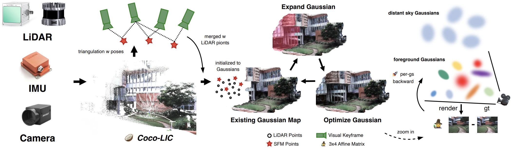
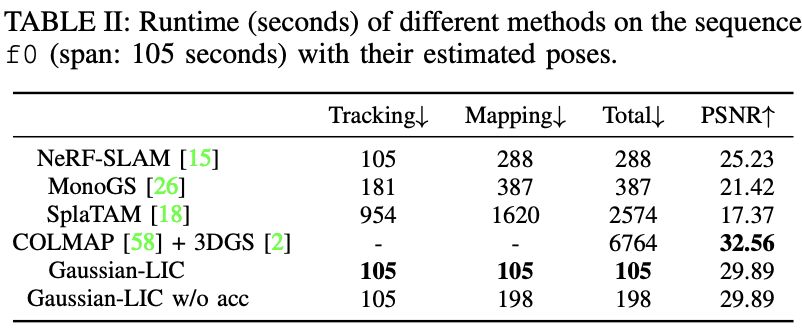
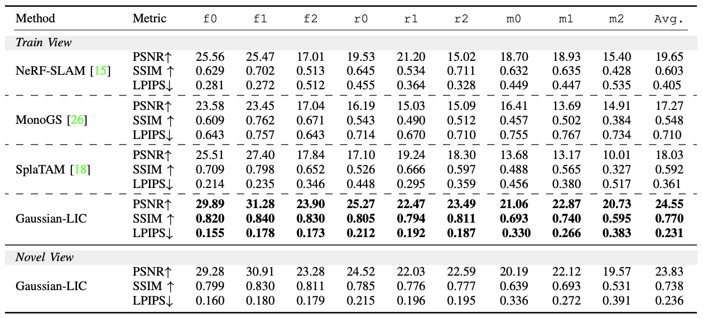
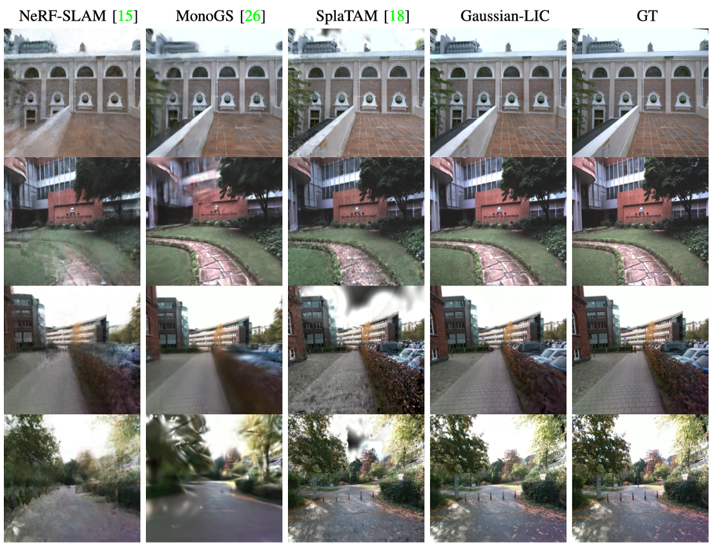
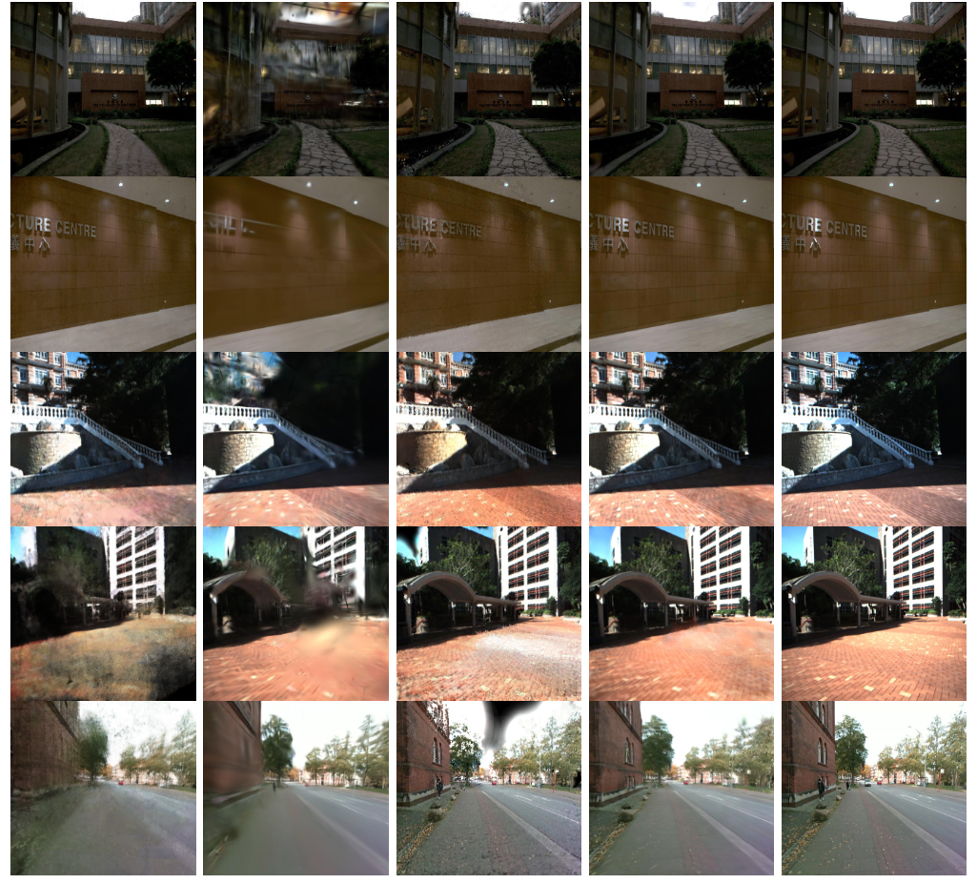

# Gaussian-LIC

**Gaussian-LIC: Real-Time Photo-Realistic SLAM with Gaussian Splatting and LiDAR-Inertial-Camera Fusion**

 

Keywords：odometry and photo-realistic mapping in real time, multimodal LiDARs with SFM, sky, exposure. 

🫶🏻 **[2024.11.03]**  The code will be released soon with the **revised Coco-LIC**. Thanks for your attention ❤️ ~

🎈 **[2024.09.26]**  The second version of our paper has been updated on arxiv on 9.26  [[`Paper`](https://arxiv.org/pdf/2404.06926)] [[`Project`](https://xingxingzuo.github.io/gaussian_lic/)] .

## Real-Time Performance Analysis

 

## Rendering Performance Comparison

All compared methods except ours utilize either the ground-truth poses or our estimated poses.

 

 

 