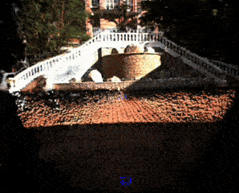
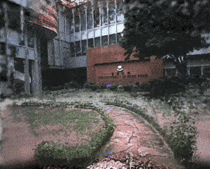

<p align="center">
  <h1 align="center">Gaussian-LIC: Real-Time Photo-Realistic SLAM with Gaussian Splatting and LiDAR-Inertial-Camera Fusion</h1>
  <p align="center">
    ICRA 2025
  </p>
  <p align="center">
    <a href="https://arxiv.org/pdf/2404.06926">
      
    </a>
    <a href='https://xingxingzuo.github.io/gaussian_lic/' style='padding-left: 0.5rem;'>
      
    </a>
  </p>
</p>

Gaussian-LIC is a photo-realistic LiDAR-Inertial-Camera Gaussian Splatting SLAM system, which simultaneously performs robust, accurate pose estimation and constructs a photo-realistic 3D Gaussian map in real time.

<p align="center">
    
    
    
</p>

### 📢 News

- [2025-07-08] Gaussian-LIC2 is unveiled! 🎉 [[`Paper`](https://arxiv.org/pdf/2507.04004)] [[`Page`](https://xingxingzuo.github.io/gaussian_lic2/)] [[`YouTube`](https://www.youtube.com/watch?v=SkPnpuCfh88)] [[`bilibili`](https://www.bilibili.com/video/BV1fJ3kzfEYv/?spm_id_from=333.337.search-card.all.click&vd_source=99ac6409fc9373f3960feff31c28a189)] (to be released here)
- [2025-07-07] The enhanced version of the Gaussian-LIC code is released!
- [2025-01-28] Gaussian-LIC is accepted to ICRA 2025! 🎉
- [2024-09-26] The second version of the paper is available on arXiv.
- [2024-04-10] The first version of the paper is available on arXiv.

### 💌 Contact

Questions? Please don't hesitate to reach out to Xiaolei Lang (Jerry) at jerry_locker@zju.edu.cn.

## Install

We test on ubuntu 20.04 with an NVIDIA RTX 3090 / 4090.

1. Exit Conda environment.

2. Prepare third-party libraries according to [Coco-LIC](https://github.com/APRIL-ZJU/Coco-LIC). 

3. Install [CUDA 11.7](https://developer.nvidia.com/cuda-11-7-1-download-archive?target_os=Linux&target_arch=x86_64&Distribution=Ubuntu&target_version=20.04&target_type=runfile_local) with [cuDNN v8.9.7](https://developer.nvidia.com/rdp/cudnn-archive).

4. Build [OpenCV 4.7.0](https://github.com/opencv/opencv/archive/refs/tags/4.7.0.tar.gz).（must be built with [opencv_contrib 4.7.0](https://github.com/opencv/opencv_contrib/archive/refs/tags/4.7.0.tar.gz) and CUDA, no installation required）

   ```shell
   mkdir -p ~/Software/opencv
   cd ~/Software/opencv
   wget https://github.com/opencv/opencv/archive/refs/tags/4.7.0.tar.gz && tar -zxvf 4.7.0.tar.gz && rm -rf 4.7.0.tar.gz
   wget https://github.com/opencv/opencv_contrib/archive/refs/tags/4.7.0.tar.gz && tar -zxvf 4.7.0.tar.gz && rm -rf 4.7.0.tar.gz
   
   cd ~/Software/opencv/opencv-4.7.0
   mkdir build && cd build
   cmake -DCMAKE_BUILD_TYPE=RELEASE -DWITH_CUDA=ON -DWITH_CUDNN=ON -DOPENCV_DNN_CUDA=ON -DWITH_NVCUVID=ON -DCUDA_TOOLKIT_ROOT_DIR=/usr/local/cuda-11.7 -DOPENCV_EXTRA_MODULES_PATH="../../opencv_contrib-4.7.0/modules" -DBUILD_TIFF=ON -DBUILD_ZLIB=ON -DBUILD_JASPER=ON -DBUILD_CCALIB=ON -DBUILD_JPEG=ON -DWITH_FFMPEG=ON ..
   make -j$(nproc)
   ```


5. Prepare [LibTorch](https://pytorch.org/get-started/locally/).（no compilation or installation required）

   ```shell
   cd ~/Software
   wget https://download.pytorch.org/libtorch/cu117/libtorch-cxx11-abi-shared-with-deps-2.0.1%2Bcu117.zip
   unzip libtorch-cxx11-abi-shared-with-deps-2.0.1+cu117.zip && rm -rf libtorch-cxx11-abi-shared-with-deps-2.0.1+cu117.zip
   ```


6. Install Coco-LIC.

   ```shell
   mkdir -p ~/catkin_coco/src
   cd ~/catkin_coco/src
   git clone https://github.com/Livox-SDK/livox_ros_driver.git
   cd ~/catkin_coco && catkin_make
   cd ~/catkin_coco/src
   git clone https://github.com/APRIL-ZJU/Coco-LIC.git
   cd ~/catkin_coco && catkin_make
   ```


7. Install Gaussian-LIC.

   ```shell
   mkdir -p ~/catkin_gaussian/src
   cd ~/catkin_gaussian/src
   git clone https://github.com/APRIL-ZJU/Gaussian-LIC.git
   cd ~/catkin_gaussian && catkin_make
   ```


## Run

Quick start on the sequence hku2 in the FAST-LIVO dataset.

- Download [FAST-LIVO Dataset](https://connecthkuhk-my.sharepoint.com/personal/zhengcr_connect_hku_hk/_layouts/15/onedrive.aspx?id=%2Fpersonal%2Fzhengcr%5Fconnect%5Fhku%5Fhk%2FDocuments%2FFAST%2DLIVO%2DDatasets&ga=1) or [R3LIVE Dataset](https://github.com/ziv-lin/r3live_dataset) or [MCD Dataset](https://mcdviral.github.io/).

+ Modify `bag_path` in the `config/ct_odometry_fastlivo.yaml` file of Coco-LIC.

+ Launch Gaussian-LIC.

  ```shell
  cd ~/catkin_gaussian
  source devel/setup.bash
  roslaunch gaussian_lic fastlivo.launch  // The terminal will print "😋 Gaussian-LIC Ready!".
  ```


+ Launch Coco-LIC.

  Note：For real-time use and runtime analysis, please turn off the rviz in Coco-LIC by commenting the sentence `<node pkg="rviz" type="rviz" name="rviz_odom" output="log" required = "true" args="-d $(find cocolic)/config/coco.rviz" />`  in `odometry.launch`.

  ```shell
  cd ~/catkin_coco
  source devel/setup.bash
  roslaunch cocolic odometry.launch config_path:=config/ct_odometry_fastlivo.yaml
  ```


+ The mapping and rendering results will be saved in  `~/catkin_gaussian/src/Gaussian-LIC/result`.

## Citation

If you find our work helpful, please consider citing 🌟:

```bibtex
@inproceedings{lang2025gaussian,
  title={Gaussian-LIC: Real-Time Photo-Realistic SLAM with Gaussian Splatting and LiDAR-Inertial-Camera Fusion}, 
  author={Lang, Xiaolei and Li, Laijian and Wu, Chenming and Zhao, Chen and Liu, Lina and Liu, Yong and Lv, Jiajun and Zuo, Xingxing},
  booktitle={2025 International Conference on Robotics and Automation (ICRA)},
  year={2025},
  organization={IEEE}
}
```

```bibtex
@article{lang2025gaussian2,
  title={Gaussian-LIC2: LiDAR-Inertial-Camera Gaussian Splatting SLAM}, 
  author={Lang, Xiaolei and Lv, Jiajun and Tang, Kai and Li, Laijian and Huang, Jianxin and Liu, Lina and Liu, Yong and Zuo, Xingxing},
  journal={arXiv}, 
  year={2025}
}
```

## Acknowledgement

Thanks for [3DGS](https://github.com/graphdeco-inria/gaussian-splatting), [Taming-3DGS](https://github.com/humansensinglab/taming-3dgs), [StopThePop](https://github.com/r4dl/StopThePop) and [Photo-SLAM](https://github.com/HuajianUP/Photo-SLAM).

## LICENSE

The code is released under the [GNU General Public License v3 (GPL-3)](https://www.gnu.org/licenses/gpl-3.0.txt).
